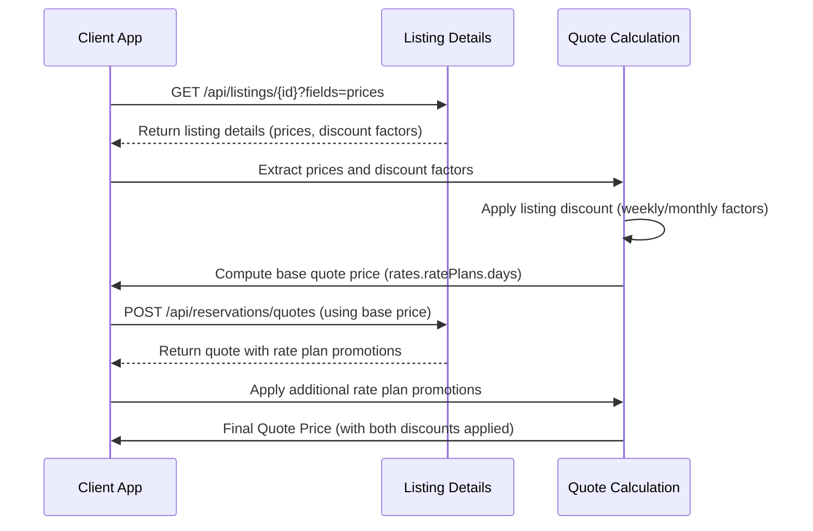

A divergência nos valores ocorre porque os dados são extraídos de estruturas diferentes, e neste caso específico, dois descontos estão sendo aplicados, mesmo que o objeto promotions retorne apenas uma promoção. Seguem os pontos que detalham a lógica de negócio:



## Listing setup:
- Ao consultar os detalhes do listing, existem fatores de desconto para estadias prolongadas.
- Esse desconto é aplicado diretamente nos valores retornados em `rates.ratePlans.days` para estadias de 7 noites ou mais (ou 30 noites ou mais).
  
GET `https://booking.guesty.com/api/listings/641db61235f145002a597243?fields=prices`
```json
{
	"prices": {
		"monthlyPriceFactor": 0.88, // Indica um desconto de 12% (pois 100% - 88% = 12%).
		"weeklyPriceFactor": 0.88,
		"guestsIncludedInRegularFee": 8,
		"basePrice": 104,
		"securityDepositFee": 200,
		"currency": "USD",
		"cleaningFee": 169,
		"petFee": 0,
		"extraPersonFee": 5,
		"weekendBasePrice": 104,
		"weekendDays": [
			5,
			6
		]
	}
}
```

## Calendário de disponibilidade:
- Os valores são obtidos do array de dias, localizado em `rates.ratePlans.days`. 
- Atualmente, esse campo retorna um valor agregado (exemplo, 877) que representa apenas uma soma dos valores diários base, sem considerar descontos por rate plan, mas já incluindo descontos específicos da listing.
- Após a criação do quote, o sistema aplica também as promoções definidas para o rate plan, as quais são refletidas no objeto `promotions`. Essa aplicação adicional resulta em uma composição *cumulativa onde os descontos do listing e do rate plan se somam.*

## Cotação de reserva:
- Ao solicitar uma cotação, o valor final é calculado e retornado na estrutura `rates.ratePlans.money`, especificamente nos campos `fareAccommodation` e `fareAccommodationAdjusted`. Esses valores são compostos considerando não só os diários, mas também taxas, ajustes, descontos _(como a promoção "DISCOUNT >7 Nights +")_ e outros componentes, conforme a lógica de negócio definida na API.

Portanto, o valor final do quote acaba refletindo ambos os descontos: o desconto de 12% já aplicado no valor base (via fatores de desconto do listing) e o desconto adicional do rate plan indicado no objeto promotions.
